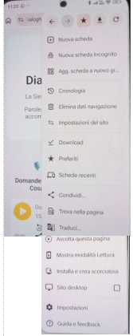
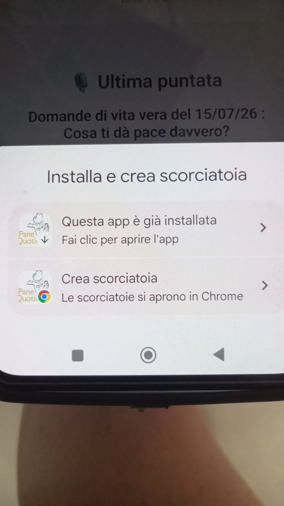
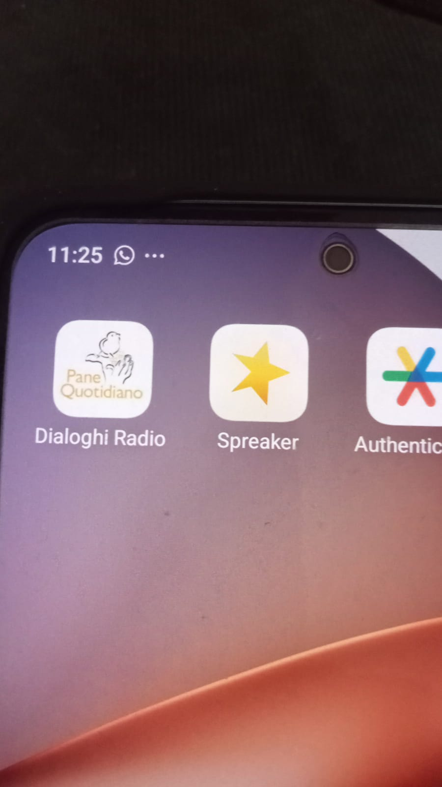

# Come installare Dialoghi Radio sul telefono

## Cos'è Dialoghi Radio

Dialoghi Radio è una web app pensata per ascoltare programmi, riflessioni, percorsi biblici e contenuti audio direttamente dal telefono.

Non è necessario scaricare un'app dal Play Store o App Store: puoi aprirla dal browser e aggiungerla alla schermata principale come una vera applicazione.

---

# Installazione su Android

## Metodo consigliato (Google Chrome)

## 1. Apri il collegamento di Dialoghi Radio con **Google Chrome**:
https://dialoghiradio.github.io/DR/

  

---

## 2. Apri il menu Chrome (i tre puntini ⋮ in alto a destra)

  

---

## 3. Installa l'app
Cerca una delle seguenti opzioni:

* **Installa**
* **Crea scorciatoia**
* **Aggiungi alla schermata Home**

*(la voce può cambiare in base al telefono)*

   

---

## 4. Icona nella Home che conferma l'installazione

  

---

## 5. App aperta dalla schermata Home

 

---

### ⚠️ Se apri il link da WhatsApp

Alcuni telefoni aprono il link dentro WhatsApp e non mostrano le opzioni di installazione.

In questo caso:

1. Copia il link
2. Apri **Google Chrome**
3. Incolla il link
4. Ripeti la procedura

---

# Installazione su iPhone

1. Apri il link con **Safari**

2. Premi il pulsante:

**Condividi ⬆️**

3. Scorri e seleziona:

**Aggiungi alla schermata Home**

4. Conferma

L'icona sarà disponibile nella schermata principale.

---
📌 Nota

Le schermate possono variare leggermente a seconda della versione di iOS.

Gli screenshot per iPhone verranno aggiunti nelle prossime versioni della guida.

# Come condividere Dialoghi Radio

Per invitare qualcuno ad ascoltare Dialoghi Radio è sufficiente condividere il link ufficiale.

Esempio:

> 🎙️ Ti condivido Dialoghi Radio
> Una radio di parole, musica e riflessioni per accompagnare la giornata
>
> Apri il link e puoi aggiungerla alla schermata Home come un'app
>
> https://dialoghiradio.github.io/DR/

---

# Nota importante

Dialoghi Radio non è disponibile sul Play Store o App Store.

Funziona tramite browser ed è installabile come Web App.

---

# Futuri sviluppi

Sono previste nuove funzioni:

* Menu laterale di navigazione
* Ascolto Live
* Palinsesto programmato
* Integrazione con i social
* Funzioni per la comunità degli ascoltatori

---

## Dialoghi Radio

Parole, musica e riflessioni per accompagnare la tua giornata.
